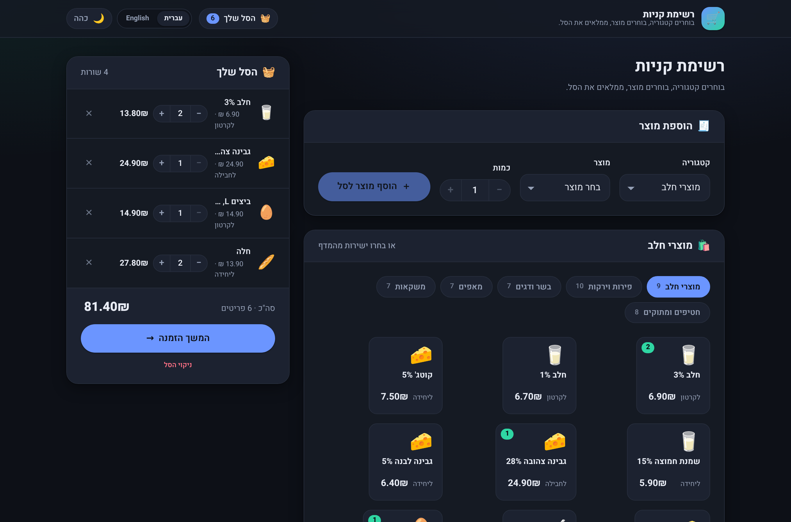
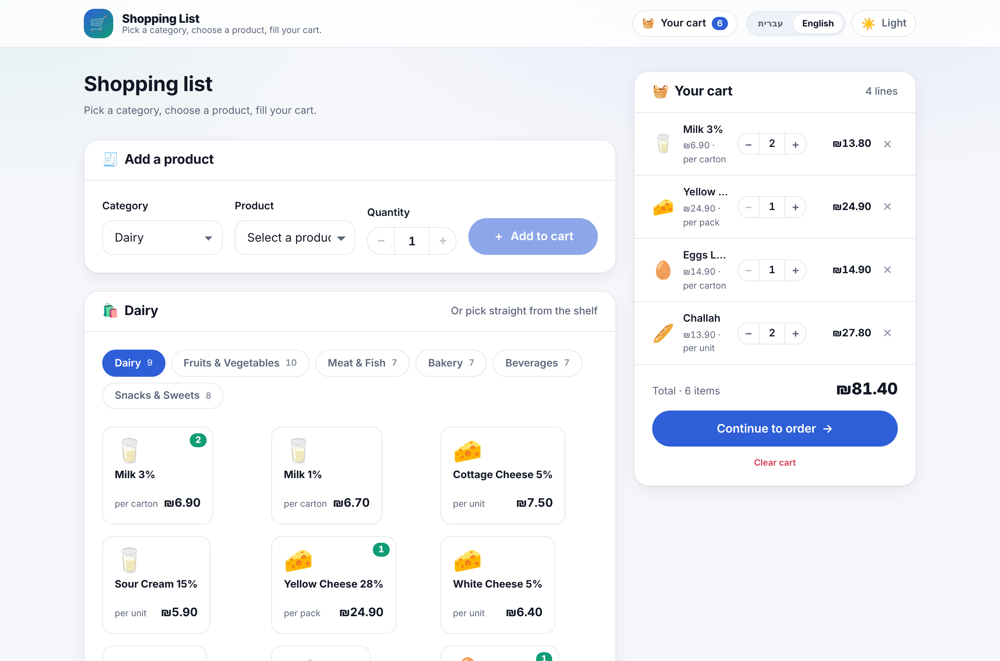
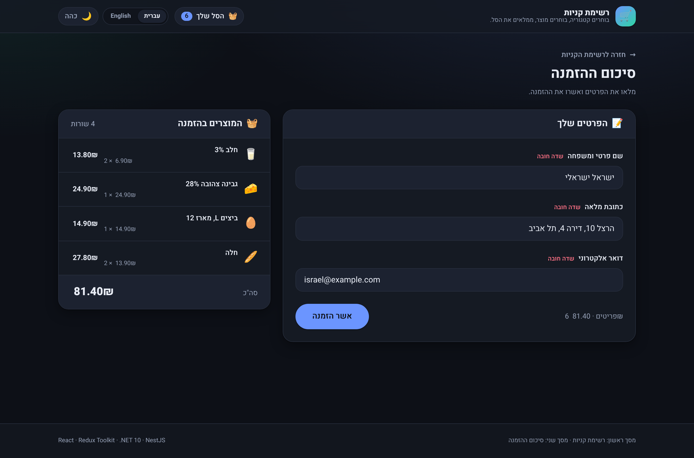
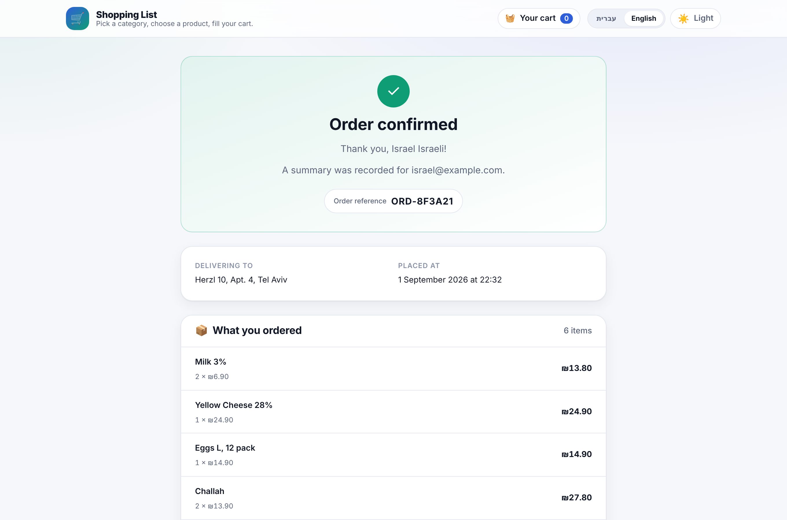

# Shopping List — Home Assignment

A two-screen shopping application built as three independently deployable
components, exactly as the assignment specifies:

| # | Component | Stack | Responsibility |
|---|-----------|-------|----------------|
| 1 | `apps/client` | React 19 + Redux Toolkit + Vite | Both screens |
| 2 | `apps/catalog-api` | .NET 10 + EF Core + **SQL Server** | Screen 1: categories and products |
| 3 | `apps/orders-api` | NestJS 11 + **Elasticsearch** (MongoDB swappable) | Screen 2: persisting orders |

Everything runs locally with Docker Compose. The Elasticsearch index mapping the
assignment asks for is at
[`infra/elasticsearch/orders.mapping.json`](infra/elasticsearch/orders.mapping.json).

### Screens

Both screens, both themes, both languages. Layout uses CSS logical properties
throughout, so one stylesheet serves right-to-left Hebrew and left-to-right
English — nothing is mirrored by hand, and no direction-specific rules exist.

| Screen 1 — Hebrew, dark | Screen 1 — English, light |
|---|---|
|  |  |

**Screen 2 — the order form.** Three required fields plus the chosen products,
shown here right-to-left.



**Order confirmed.** Rendered from the orders service response — the reference
and the total are computed server-side, never sent by the client.




### Documentation

| Document | What it covers |
|---|---|
| [`docs/ARCHITECTURE.md`](docs/ARCHITECTURE.md) | **Start here.** Every technology and design pattern used, with the reasoning and the rejected alternatives — EF Core modelling, the Elasticsearch mapping, the ports-and-adapters persistence layer, Redux state ownership, a design-pattern index and a decision log |
| [`docs/CONTRACT.md`](docs/CONTRACT.md) | The binding API contract all three components were built against |
| [`docs/diagrams/`](docs/diagrams/) | PlantUML sequence and component diagrams, with rendered SVGs |
| [`docs/api-examples.http`](docs/api-examples.http) | **Runnable requests** for both APIs and Elasticsearch — open in VS Code with the REST Client extension, or Rider/IntelliJ, and click Send |
| [`apps/*/README.md`](apps/) | Per-service detail |

---

## Quick start

Prerequisites: Docker Desktop (or Docker Engine) with Compose v2. Nothing else.

```bash
git clone <this-repo> && cd shopping-list
docker compose --profile apps up -d --build
```

First run pulls images and builds three containers, so expect a few minutes.
Then open **<http://localhost:8080>**.

| Service | URL |
|---------|-----|
| Client | <http://localhost:8080> |
| Catalog API (Swagger) | <http://localhost:5080/swagger> |
| Orders API (Swagger) | <http://localhost:3000/docs> |
| Elasticsearch | <http://localhost:9200> |
| SQL Server | `localhost,1433` — user `sa`, password `Your_strong_Passw0rd` |
| MongoDB | `mongodb://localhost:27018` |

Optional database viewers, started separately — see
[Database viewers](#database-viewers):

| Viewer | URL | Started by |
|--------|-----|------------|
| mongo-express | <http://localhost:8081> | `--profile tools` |
| Elasticvue | <http://localhost:8082> | `--profile tools` |
| Kibana | <http://localhost:5601> | `--profile kibana` |

The catalog database is created and seeded automatically on first start
(6 categories, 48 products, each with Hebrew and English names). The
Elasticsearch `orders` index is created from the mapping file on first start.
Both steps are idempotent.

To check it worked:

```bash
curl http://localhost:5080/health          # {"status":"healthy","database":"connected"}
curl http://localhost:3000/health          # {"status":"ok","driver":"elasticsearch","store":"connected"}
curl http://localhost:9200/orders/_mapping # the mapping the service installed
```

Shut down with `docker compose --profile apps down`, or
`docker compose --profile apps down -v` to also drop the data volumes. Note that
`down` stops **everything** regardless of profile — it is not the mirror image of
the `up` you ran.

### Run modes at a glance

| I want… | Command | Containers |
|---|---|---|
| **Only the databases** — run the three apps from an IDE | `docker compose up -d` | 3: `sqlserver`, `elasticsearch`, `mongodb` |
| **Everything** | `docker compose --profile apps up -d` | 6: the 3 databases + `catalog-api`, `orders-api`, `client` |
| **Databases + DB viewers** | `docker compose --profile tools up -d` | 5: the 3 databases + `mongo-express`, `elasticvue` |
| **Everything + DB viewers** | `docker compose --profile apps --profile tools up -d` | 8 |
| **Add Kibana too** | `docker compose --profile kibana up -d` | + `kibana` |

The three databases carry no profile, so they start in every mode. Check what is
actually up with `docker compose ps`.

### Connection cheat sheet

Everything you need to reach any part of the running stack, in one place.

| Target | URL / connection string | Notes |
|---|---|---|
| **Client** | <http://localhost:8080> | Containerised (nginx). Dev server is <http://localhost:5173> |
| **Catalog API** | <http://localhost:5080> | Swagger UI at **<http://localhost:5080/swagger>** |
| **Orders API** | <http://localhost:3000> | Swagger UI at **<http://localhost:3000/docs>**, raw document at `/docs-json` |
| **SQL Server** — SSMS / Azure Data Studio | Server `localhost,1433`, SQL auth, login `sa`, password `Your_strong_Passw0rd`, database `CatalogDb` | ⚠️ **Tick "Trust server certificate"** or the connection is refused |
| **SQL Server** — connection string | `Server=localhost,1433;Database=CatalogDb;User Id=sa;Password=Your_strong_Passw0rd;TrustServerCertificate=True;` | |
| **Elasticsearch** — HTTP | <http://localhost:9200> | No auth. `curl localhost:9200/orders/_search?pretty` |
| **Elasticsearch** — Elasticvue viewer | <http://localhost:8082> | `--profile tools`. On first load enter cluster URI `http://localhost:9200`, no auth |
| **Elasticsearch** — Kibana | <http://localhost:5601> | `--profile kibana`. Dev Tools → `GET orders/_search` |
| **MongoDB** — Compass / shell | `mongodb://localhost:27018` | **27018, not 27017** — deliberate, see [Ports and locally installed databases](#ports-and-locally-installed-databases). No auth. DB `orders`, collection `orders` |
| **MongoDB** — mongo-express viewer | <http://localhost:8081> | `--profile tools`, no login |

> **Which store holds the orders?** Elasticsearch, by default — `NOSQL_DRIVER`
> defaults to `elasticsearch`. Confirm at any time with
> `curl http://localhost:3000/health`, whose `driver` field names the live store.
> See [Choosing the orders database](#choosing-the-orders-database) to switch.

### Ports and locally installed databases

Developer machines very often already run SQL Server or MongoDB natively, and
those installs own the standard ports. This is the nastiest class of problem here
because **nothing errors loudly**: either the container fails to bind the port, or
your GUI quietly connects to the *local* instance and shows an empty or
unfamiliar database while the application is happily using the container.

Two deliberate choices, so a fresh clone works on the widest range of machines:

| Database | Host port | Why |
|---|---|---|
| **MongoDB** | **27018** | Moved off the default 27017. A local MongoDB install is common, and it is the one most likely to clash silently |
| SQL Server | 1433 | Left on the canonical port. A default-instance local SQL Server would clash, but SQL Express usually uses a named instance on a dynamic port, so a collision is much rarer |
| Elasticsearch | 9200 | Rarely installed natively |

Inside Docker nothing changes: the services reach each other over the Compose
network as `mongodb:27017`, `sqlserver:1433` and `elasticsearch:9200`. The host
port only matters to tools on **your** machine, and to an app you run natively.

**Which one am I connected to?** Ask the container directly — whatever these
print is the truth:

```bash
docker compose ps                       # is the container actually running?

docker exec -it sl-mongodb mongosh --quiet \
  --eval "db.getMongo().getDBNames()"

docker exec -it sl-sqlserver /opt/mssql-tools18/bin/sqlcmd \
  -S localhost -U sa -P "Your_strong_Passw0rd" -C \
  -Q "SELECT name FROM sys.databases"
```

If your GUI disagrees with that, you are looking at your local install.

**Still clashing?** Copy `.env.example` to `.env` and move the offending service:

```ini
MSSQL_PORT=1434
MONGODB_PORT=27019
ELASTICSEARCH_PORT=9201
```

then `docker compose up -d`. Point your GUI at the new port. If you also run
**orders-api natively**, update `MONGODB_URI` in `apps/orders-api/.env` to match —
a natively-run service uses the host port, not the Compose network. Likewise
catalog-api's connection string if you move `MSSQL_PORT`.

### Running the apps from your IDE instead

Start only the databases, then run each app natively with hot reload:

```bash
docker compose up -d          # SQL Server, Elasticsearch, MongoDB only

cd apps/catalog-api && dotnet run --project src/CatalogApi   # → :5080
cd apps/orders-api  && npm install && npm run start:dev      # → :3000
cd apps/client      && npm install && npm run dev            # → :5173
```

The default configuration of each app already points at `localhost` for its
database and its sibling services, so no `.env` file is required.
[Building and running each project](#building-and-running-each-project) below has
the full command reference for all three.

> **Apple Silicon note.** `mcr.microsoft.com/mssql/server` has no arm64 image, so
> on an M-series Mac it runs under emulation. It works, but the first start is
> slow — allow SQL Server up to a minute before the catalog API reports healthy.
> Compose already gates start-up on the health check, so this is a matter of
> patience rather than configuration.

---

## Building and running each project

Each service is a self-contained project with its own toolchain. This section is
the full reference; the quick start above is the short version.

### Prerequisites

| For | You need | Check with |
|---|---|---|
| Everything via Docker | Docker Desktop / Engine with Compose v2 | `docker compose version` |
| `apps/catalog-api` natively | .NET SDK 10.0+ | `dotnet --version` |
| `apps/orders-api` natively | Node.js 20+ (22 recommended) | `node -v` |
| `apps/client` natively | Node.js 20+ | `node -v` |
| Rendering the diagrams | Java + PlantUML + Graphviz | `java -version`, `dot -V` |

Running natively still needs the **databases**, which is what
`docker compose up -d` (no profile) starts.

---

### 1. `apps/catalog-api` — .NET 10 + EF Core + SQL Server

```bash
cd apps/catalog-api

dotnet restore                              # restore NuGet packages
dotnet build                                # compile (Debug)
dotnet build -c Release                     # compile (Release)
dotnet test                                 # run the 54 xUnit tests
dotnet test --collect:"XPlat Code Coverage" # with coverage

dotnet run --project src/CatalogApi         # run  → http://localhost:5080
dotnet watch --project src/CatalogApi       # run with hot reload
```

Then open <http://localhost:5080/swagger>.

The solution file is `CatalogApi.sln`, so `dotnet build` from the app root builds
both the API and the test project. Opening that `.sln` in Visual Studio or Rider
gives you F5 debugging with no further setup — `Properties/launchSettings.json`
already targets port 5080.

Publish a self-contained output:

```bash
dotnet publish src/CatalogApi -c Release -o ./publish
```

Configuration comes from `appsettings.json`, overridden by environment variables
using the `__` separator:

```bash
# macOS / Linux
ConnectionStrings__CatalogDb="Server=localhost,1433;Database=CatalogDb;User Id=sa;Password=Your_strong_Passw0rd;TrustServerCertificate=True;" \
  dotnet run --project src/CatalogApi

# Windows PowerShell
$env:ConnectionStrings__CatalogDb="Server=localhost,1433;Database=CatalogDb;User Id=sa;Password=Your_strong_Passw0rd;TrustServerCertificate=True;"
dotnet run --project src/CatalogApi
```

Build the Docker image on its own:

```bash
docker build -t catalog-api ./apps/catalog-api
docker run --rm -p 5080:8080 catalog-api
```

---

### 2. `apps/orders-api` — NestJS + Elasticsearch / MongoDB

```bash
cd apps/orders-api

npm install                 # or `npm ci` for an exact lockfile install
npm run build               # compile TypeScript → dist/
npm run lint                # ESLint
npm test                    # 316 unit tests + coverage thresholds
npm run test:watch          # watch mode
npm run test:cov            # explicit coverage report
npm run test:e2e            # 45 supertest end-to-end tests

npm run start:dev           # watch mode  → http://localhost:3000
npm start                   # run once
node dist/main.js           # run the compiled output
```

Then open <http://localhost:3000/docs> (raw document at
<http://localhost:3000/docs-json>).

Copy `.env.example` to `.env` to change anything — most usefully
`NOSQL_DRIVER`, which switches the entire persistence layer. Every value has a
working default, so the service runs with no `.env` at all.

Build the Docker image on its own — note the build context is the **repository
root**, because the image also needs the Elasticsearch mapping file:

```bash
docker build -f apps/orders-api/Dockerfile -t orders-api .
docker run --rm -p 3000:3000 orders-api
```

---

### 3. `apps/client` — React 19 + Redux Toolkit + Vite

```bash
cd apps/client

npm install                 # or `npm ci`
npm start                   # dev server with HMR → http://localhost:5173
npm run dev                 # identical - Vite's own name for it
npm run build               # type-check then bundle → dist/
npm run preview             # serve the built bundle → http://localhost:4173

npm run lint                # ESLint
npm run typecheck           # tsc --noEmit
npm test                    # 313 Vitest tests
npm run test:watch          # watch mode
npm run test:cov            # coverage, thresholds enforced
```

Copy `.env.example` to `.env` if the APIs are not on their default ports.
Remember that Vite inlines these at **build** time, so a change means restarting
the dev server or rebuilding.

Build the Docker image on its own (nginx serving the static bundle):

```bash
docker build -t shopping-client ./apps/client
docker run --rm -p 8080:80 shopping-client
```

---

### Running everything at once

```bash
# From the repository root — every check that CI would run
(cd apps/client     && npm ci && npm run lint && npm run typecheck && npm test)
(cd apps/orders-api && npm ci && npm run lint && npm test && npm run test:e2e)
(cd apps/catalog-api && dotnet test)
```

### Regenerating the diagrams

The rendered SVGs in `docs/diagrams/rendered/` are committed so they can be
viewed without any toolchain. To regenerate after editing a `.puml`:

```bash
# needs Java, plantuml.jar and Graphviz on the PATH
java -jar plantuml.jar -tsvg -o rendered docs/diagrams/*.puml
```

Most IDEs also render `.puml` files directly — there are PlantUML plugins for
VS Code, Rider and IntelliJ — and <https://www.plantuml.com/plantuml> renders a
pasted file with nothing installed.

---

## Choosing the orders database

The orders service persists to **Elasticsearch by default**, which is the store
the assignment prefers. MongoDB is a fully-implemented second driver, selected
at runtime by one environment variable. No code changes, no rebuild — the two
adapters are both compiled into the image and the DI container picks one at
startup.

Both databases run in Compose either way, so switching is instant.

### With Elasticsearch (the default)

Nothing to do:

```bash
docker compose --profile apps up -d
curl http://localhost:3000/health
# {"status":"ok","driver":"elasticsearch","store":"connected"}
```

### With MongoDB

**Persistently** — copy `.env.example` to `.env`, set `NOSQL_DRIVER=mongodb`,
then recreate just the orders service:

```bash
cp .env.example .env          # then edit NOSQL_DRIVER=mongodb
docker compose --profile apps up -d orders-api
```

**For one run**, without touching any file:

```bash
# macOS / Linux
NOSQL_DRIVER=mongodb docker compose --profile apps up -d orders-api

# Windows PowerShell
$env:NOSQL_DRIVER="mongodb"; docker compose --profile apps up -d orders-api
```

Either way, confirm the swap took effect:

```bash
curl http://localhost:3000/health
# {"status":"ok","driver":"mongodb","store":"connected"}
```

Switch back by setting `NOSQL_DRIVER=elasticsearch` (or removing the variable)
and re-running the same command.

### From your IDE

Set the variable in `apps/orders-api/.env` and restart:

```bash
cd apps/orders-api
cp .env.example .env          # then edit NOSQL_DRIVER
npm run start:dev
```

> **Orders do not migrate between stores.** They are two independent databases.
> An order placed while Elasticsearch was active is not visible after switching
> to MongoDB, and vice versa — that is expected, not a bug. Place a fresh order
> after switching if you want to see data in the new store.

To prove the swap really is behaviour-preserving without running anything, the
shared contract suite in `apps/orders-api/src/persistence/__tests__/` executes
the same assertions against both adapters:

```bash
cd apps/orders-api && npm test -- order-repository.contract
```

---

## Database viewers

### Local client or container?

The rule of thumb: **containerise the viewer when the tool is web-native and
stateless; install locally when the tool is a mature desktop application whose
whole value is the ergonomics.**

Containers keep your machine clean, cost nothing to throw away, and make the
tooling self-documenting in the repo — anyone who clones this gets the same
viewers with one command. Native clients win on comfort: saved connections,
query history, IntelliSense, result grids you would actually want to work in
all day.

Applied here:

| Database | Recommendation | Why |
|---|---|---|
| **SQL Server** | **Install locally** — SSMS or Azure Data Studio | Nothing containerised comes close. SSMS is the reference tool and it is free |
| **MongoDB** | Either | Compass is nicer for real work; `mongo-express` is fine for a quick look and needs no install |
| **Elasticsearch** | **Container** | There is no mature desktop client. Elasticvue is tiny and purpose-built; Kibana is the official one |

Start the containerised viewers — they are behind their own profile, so they
never run as part of the normal stack:

```bash
docker compose --profile tools up -d      # mongo-express + Elasticvue
docker compose --profile kibana up -d     # Kibana as well (needs ~1GB RAM)
```

Stop them again with `docker compose --profile tools down`, which leaves the
application stack running.

### SQL Server — SSMS or Azure Data Studio

Install [SSMS](https://learn.microsoft.com/sql/ssms/download-sql-server-management-studio-ssms)
(Windows) or [Azure Data Studio](https://learn.microsoft.com/azure-data-studio/download-azure-data-studio)
(Windows/macOS/Linux), then connect with:

| Field | Value |
|---|---|
| Server name | `localhost,1433` |
| Authentication | SQL Server Authentication |
| Login | `sa` |
| Password | `Your_strong_Passw0rd` |
| Database | `CatalogDb` |

> **The one gotcha:** SSMS 20+ and Azure Data Studio default to encrypted
> connections and will refuse the container's self-signed certificate with
> *"A connection was successfully established … certificate chain was issued by
> an authority that is not trusted."* Tick **Trust server certificate** in the
> connection dialog (Options → Connection Properties in SSMS). This is the same
> reason the app's own connection string carries `TrustServerCertificate=True`.

Connection string form, if you prefer to paste one:

```
Server=localhost,1433;Database=CatalogDb;User Id=sa;Password=Your_strong_Passw0rd;TrustServerCertificate=True;
```

Something to run once connected:

```sql
SELECT c.NameEn, c.NameHe, COUNT(p.Id) AS Products
FROM Categories c
LEFT JOIN Products p ON p.CategoryId = c.Id
GROUP BY c.NameEn, c.NameHe, c.SortOrder
ORDER BY c.SortOrder;
```

No GUI to hand? The image ships `sqlcmd`:

```bash
docker exec -it sl-sqlserver /opt/mssql-tools18/bin/sqlcmd \
  -S localhost -U sa -P 'Your_strong_Passw0rd' -C \
  -Q "SELECT TOP 5 NameEn, PricePerUnit FROM CatalogDb.dbo.Products"
```

### MongoDB — Compass or mongo-express

[MongoDB Compass](https://www.mongodb.com/products/tools/compass) is free and
cross-platform. Connection string:

```
mongodb://localhost:27018
```

⚠️ **27018, not MongoDB's usual 27017** — deliberate, see
[Ports and locally installed databases](#ports-and-locally-installed-databases).
No username or password. Orders land in database **`orders`**, collection
**`orders`**.

> **When does the collection appear?** MongoDB normally creates a database and
> collection lazily, on first write — but this service does not wait for that.
> `MongoOrderRepository` calls `createIndexes` on start-up, and `createIndexes`
> against a missing collection creates it. So the `orders` database and its
> collection exist, empty and indexed, from the moment orders-api starts **with
> `NOSQL_DRIVER=mongodb`**.
>
> Running the default Elasticsearch driver, Mongo stays entirely empty and
> Compass shows no `orders` database at all. That is expected — the two stores
> are independent, and only the active driver is ever touched.

Or use the containerised UI with nothing to install:

```bash
docker compose --profile tools up -d mongo-express
```

Then open **<http://localhost:8081>** and pick the `orders` database.

Shell alternative:

```bash
docker exec -it sl-mongodb mongosh --quiet \
  --eval 'db.getSiblingDB("orders").orders.find().sort({createdAt:-1}).limit(3)'
```

### Elasticsearch — an HTTP client is usually the best tool

Elasticsearch *is* an HTTP API, so the most direct way to talk to it needs no
container at all. [`docs/api-examples.http`](docs/api-examples.http) has every
useful query already written out — cluster health, the installed mapping, the
`nested` item query alongside its broken non-nested twin, revenue and
best-seller aggregations, and a request proving the mapping is strict. Open it
in VS Code with the **REST Client** extension (built in to Rider and IntelliJ)
and click *Send Request*.

That beats a GUI on three counts: the queries are version-controlled, they are
the real Query DSL rather than a form that hides it, and a reviewer can run them
without installing or starting anything.

No editor extension either? Plain curl:

```bash
curl 'http://localhost:9200/orders/_search?pretty&size=3&sort=createdAt:desc'
curl 'http://localhost:9200/orders/_mapping?pretty'
```

If you prefer to click around, there are two graphical options.

```bash
docker compose --profile tools up -d elasticvue
```

Open **<http://localhost:8082>**. On first load it asks for a cluster to
connect to — enter **`http://localhost:9200`**, leave authentication empty, and
click connect. Browse the `orders` index under *Indices*, or run queries under
*Search*.

> Elasticvue runs in your browser and calls the cluster directly, so
> Elasticsearch has to allow cross-origin requests. The Compose file already
> sets `http.cors.*` for this. If you built the stack before this was added,
> recreate that one container — the data volume is untouched:
> ```bash
> docker compose up -d --force-recreate elasticsearch
> ```

For the official, much richer UI:

```bash
docker compose --profile kibana up -d
```

Open **<http://localhost:5601>** (allow a minute for the first boot), then
*Management → Dev Tools* and run:

```
GET orders/_search
{ "query": { "match_all": {} }, "sort": [{ "createdAt": "desc" }] }
```

Kibana wants roughly a gigabyte of RAM. If you only want to look at a few
documents, Elasticvue or plain `curl` is the lighter choice:

```bash
curl 'http://localhost:9200/orders/_search?pretty&size=3&sort=createdAt:desc'
curl 'http://localhost:9200/orders/_mapping?pretty'
```

---

## Architecture

[`docs/ARCHITECTURE.md`](docs/ARCHITECTURE.md) is the full write-up — every
technology and pattern with its reasoning, a design-pattern index and a decision
log. Diagrams are in [`docs/diagrams/`](docs/diagrams/) as PlantUML source with
rendered SVGs:

| Diagram | Shows |
|---|---|
| [`00-system-overview`](docs/diagrams/rendered/00-system-overview.svg) | Components, deployment and the two persistence paths |
| [`01-screen1-browse-and-add`](docs/diagrams/rendered/01-screen1-browse-and-add.svg) | Page load → catalog query → product added to the cart |
| [`02-screen2-place-order`](docs/diagrams/rendered/02-screen2-place-order.svg) | Checkout form → validation → order persisted in Elasticsearch |
| [`03-driver-swap`](docs/diagrams/rendered/03-driver-swap.svg) | How one env var routes the same call to a different database |
| [`04-startup-and-seeding`](docs/diagrams/rendered/04-startup-and-seeding.svg) | Cold start: healthchecks, schema creation, seeding, index bootstrap |

```
                          ┌─────────────────────────────┐
                          │   apps/client (React 19)    │
                          │   Redux Toolkit + RTK Query │
                          │   :5173 dev · :8080 nginx   │
                          └──────────┬───────┬──────────┘
                   screen 1 · GET    │       │   screen 2 · POST
                                     ▼       ▼
              ┌──────────────────────────┐  ┌────────────────────────────┐
              │  apps/catalog-api        │  │  apps/orders-api           │
              │  .NET 10 Web API         │  │  NestJS 11                 │
              │  EF Core                 │  │  ports & adapters          │
              │  :5080                   │  │  :3000                     │
              └───────────┬──────────────┘  └─────┬─────────────────┬────┘
                          │                       │  NOSQL_DRIVER   │
                          ▼                       ▼                 ▼
                  ┌──────────────┐      ┌─────────────────┐  ┌────────────┐
                  │  SQL Server  │      │  Elasticsearch  │  │  MongoDB   │
                  │    :1433     │      │      :9200      │  │   :27018   │
                  └──────────────┘      └─────────────────┘  └────────────┘
                                          (default driver)     (alternative)
```

The two backends share nothing — no database, no library, no deployment unit.
They are joined only by the browser, which is what the assignment's three-part
split implies. The contract between all three is pinned in
[`docs/CONTRACT.md`](docs/CONTRACT.md): DTO shapes, endpoint paths, ports and
environment variable names live in one file that every component was built
against, so the wire format is a specification rather than an accident.

### Repository layout

```
.
├── docker-compose.yml          the whole local stack
├── .env.example                compose overrides (ports, passwords, driver)
├── docs/CONTRACT.md            the shared API + design contract
├── infra/elasticsearch/
│   └── orders.mapping.json     the deliverable index mapping
└── apps/
    ├── client/                 React + Redux Toolkit SPA
    ├── catalog-api/            .NET 10 + EF Core + SQL Server
    └── orders-api/             NestJS + Elasticsearch / MongoDB
```

Each app has its own README with the detail for that component.

---

## The two screens

### Screen 1 — shopping list

`GET /api/categories` returns every category **with its products embedded**, so
the whole screen is populated by a single request on mount, which is what
requirement 1 asks for. Choosing a category enables the product dropdown;
choosing a product enables the quantity stepper and the *add to cart* button.
The cart renders beside it and updates immediately on every add.

Alongside the dropdown flow required by the assignment there is a visual product
grid, because a dropdown-only supermarket is not something anyone would ship.
Both paths dispatch the same `cart/itemAdded` action, so the required flow is
fully intact and independently testable.

### Screen 2 — order summary

The checkout form has the three required fields — full name, full address, email
— each validated on the client and again on the server. Below the form is the
list of products chosen on screen 1. *Confirm order* POSTs the customer details
**and the item array** to the orders service, which persists both as one
document, then the app shows a receipt with the order reference.

---

## Design decisions worth explaining

### The orders service is pluggable at the persistence layer

The assignment allows MongoDB or Elasticsearch and prefers Elasticsearch. Rather
than choose one and lose the other, `OrdersService` depends on an abstract
`OrderRepository` port. Two adapters implement it, and a dynamic
`PersistenceModule` registers exactly one against the `ORDER_REPOSITORY` token
based on `NOSQL_DRIVER`:

```bash
NOSQL_DRIVER=elasticsearch   # default, per the assignment's preference
NOSQL_DRIVER=mongodb         # the entire persistence layer swaps
```

Nothing above the repository knows which store is live — not the service, not
the controller, not the client. A shared contract test suite runs against **both**
adapters and asserts they produce byte-identical `Order` results, so the swap is
proven behaviour-preserving rather than merely claimed.

See [Choosing the orders database](#choosing-the-orders-database) for the exact
commands to run either way.

### Totals are computed on the server

The client sends quantities and unit prices; it does not send totals. The orders
service recomputes `lineTotal`, `itemCount` and `totalAmount` itself. A client is
an untrusted input, and money that a browser can set is money a browser can
change.

### The Elasticsearch mapping is explicit and strict

`orders.mapping.json` sets `dynamic: "strict"`, so a document with an unexpected
field is rejected rather than silently inventing a field type. `items` is a
`nested` type rather than the default object array: without it, Elasticsearch
flattens the array and a query for "orders containing 2 cartons of milk" would
match an order containing 2 of something else and a carton of something else
again. Emails are a `keyword` with a lowercase normalizer so lookups are
case-insensitive without analysing them as prose. The service creates the index
from this file at startup if it is absent, and a test asserts the file and the
embedded fallback copy have not drifted apart.

### The catalog is bilingual at the data layer

Every category and product carries both `nameHe` and `nameEn`. The client picks
the right one for the active locale, so switching language re-labels the whole
catalog with no refetch and no second request. Translating a product list in the
UI layer would have meant either a translation file that drifts from the database
or a second round trip.

### One stylesheet serves both writing directions

The client uses CSS logical properties throughout — `margin-inline-start` rather
than `margin-left`, `inset-inline-end` rather than `right`. Switching `dir` on
`<html>` therefore mirrors the entire layout correctly with no RTL-specific
stylesheet and no `[dir=rtl]` override sprawl. Only two rules key off direction
explicitly, both of which are genuinely directional (a dropdown chevron and a
back arrow). Prices and email inputs are wrapped in `direction: ltr` isolation so
they do not scramble inside Hebrew text.

### Theme is three-state, not two

Light, dark, and *follow the system*. In system mode the app subscribes to
`prefers-color-scheme` and re-paints live when the OS changes. An inline script
in `index.html` applies the persisted choice before first paint, so a reload
never flashes the wrong palette.

### Client state versus server state

Categories, products and orders live in RTK Query — cached, deduplicated,
tag-invalidated, never copied into a reducer. Only the cart and the UI
preferences live in plain slices, because only they are genuinely owned by the
client. The cart is keyed by `productId` so adding the same product twice
increments one line rather than duplicating it, and totals are derived with
memoised selectors so they cannot drift from the items. Cart and preferences are
persisted to `localStorage` through a listener middleware, and everything read
back is validated field by field — corrupted storage degrades to an empty cart
instead of crashing the app.

### Database schema creation

The catalog service calls `EnsureCreatedAsync()` at startup rather than shipping
a hand-written EF migration, and retries the SQL Server connection with backoff
because the container takes time to accept connections. The reasoning, and the
exact command to generate real migrations for a production setup, are in
[`apps/catalog-api/MIGRATIONS.md`](apps/catalog-api/MIGRATIONS.md).

---

## Configuration

Every value below has a working default; no `.env` file is needed to run the
stack. See [`docs/CONTRACT.md` §4](docs/CONTRACT.md) for the authoritative list.

### Compose (`.env` at the repo root)

| Variable | Default | Purpose |
|---|---|---|
| `CLIENT_PORT` / `CATALOG_API_PORT` / `ORDERS_API_PORT` | `8080` / `5080` / `3000` | Host ports |
| `MSSQL_PORT` / `ELASTICSEARCH_PORT` / `MONGODB_PORT` | `1433` / `9200` / **`27018`** | Database host ports |
| `MONGO_EXPRESS_PORT` / `ELASTICVUE_PORT` / `KIBANA_PORT` | `8081` / `8082` / `5601` | Viewer ports (`tools` / `kibana` profiles) |
| `MSSQL_SA_PASSWORD` | `Your_strong_Passw0rd` | Must meet SQL Server's policy |
| `NOSQL_DRIVER` | `elasticsearch` | `elasticsearch` \| `mongodb` |
| `VITE_DEFAULT_LOCALE` | `he` | Initial UI language |

### catalog-api

| Variable | Default |
|---|---|
| `ConnectionStrings__CatalogDb` | `Server=localhost,1433;Database=CatalogDb;User Id=sa;Password=Your_strong_Passw0rd;TrustServerCertificate=True;` |
| `Catalog__AutoMigrate` | `true` |
| `Catalog__SeedData` | `true` |
| `Cors__AllowedOrigins__0` | `http://localhost:5173` |

### orders-api

| Variable | Default |
|---|---|
| `NOSQL_DRIVER` | `elasticsearch` |
| `ELASTICSEARCH_NODE` / `ELASTICSEARCH_INDEX` | `http://localhost:9200` / `orders` |
| `MONGODB_URI` / `MONGODB_DATABASE` / `MONGODB_COLLECTION` | `mongodb://localhost:27018` / `orders` / `orders` |
| `CORS_ORIGINS` | `http://localhost:5173` |

### client

Vite inlines `import.meta.env` at build time, so these are build-time values.

| Variable | Default |
|---|---|
| `VITE_CATALOG_API_URL` | `http://localhost:5080` |
| `VITE_ORDERS_API_URL` | `http://localhost:3000` |
| `VITE_DEFAULT_LOCALE` | `he` |

---

## API reference

### Catalog (`http://localhost:5080`)

| Method | Path | Returns |
|---|---|---|
| `GET` | `/api/categories` | All categories, each with its active products |
| `GET` | `/api/categories/{id}` | One category with products, or `404` |
| `GET` | `/api/products?categoryId=` | Flat product list, optionally filtered |
| `GET` | `/health` | `{"status":"healthy","database":"connected"}` |
| `GET` | `/swagger` | Interactive documentation |

Errors are RFC 7807 `application/problem+json`.

### Orders (`http://localhost:3000`)

| Method | Path | Returns |
|---|---|---|
| `POST` | `/api/orders` | `201` with the persisted order |
| `GET` | `/api/orders/{id}` | One order, or `404` |
| `GET` | `/api/orders?limit=&offset=` | `{ total, items }`, newest first |
| `GET` | `/health` | `{"status":"ok","driver":"...","store":"connected"}` |
| `GET` | `/docs` | Interactive documentation |

Placing an order from the command line:

```bash
curl -X POST http://localhost:3000/api/orders \
  -H 'Content-Type: application/json' \
  -d '{
    "customer": {
      "fullName": "ישראל ישראלי",
      "address": "הרצל 10, תל אביב",
      "email": "israel@example.com"
    },
    "items": [{
      "productId": 101, "categoryId": 1,
      "nameEn": "Milk 3%", "nameHe": "חלב 3%",
      "unit": "carton", "quantity": 2, "unitPrice": 6.90
    }],
    "locale": "he"
  }'
```

---

## Tests

```bash
cd apps/client      && npm test            # 313 tests, 100% statements/lines
cd apps/orders-api  && npm test            # 316 unit tests, 100% statements
cd apps/orders-api  && npm run test:e2e    # 45 end-to-end tests
cd apps/catalog-api && dotnet test         # 54 tests
```

Coverage thresholds are enforced in the test configuration of both Node
projects, so a drop in coverage fails the run rather than producing a warning
nobody reads.

**Client** — Vitest, Testing Library and MSW. Components render inside the real
provider stack (real store, real i18next, real router); only the network is
mocked, at the HTTP boundary. `src/App.test.tsx` walks the whole journey — load
the catalog, add products through both flows, fill the form, submit — and
asserts on the exact payload the orders API received. A dedicated suite guards
the translation bundles: every key must exist in both languages, no string may
be empty, and interpolation placeholders must match, so a forgotten Hebrew
translation is a failing test rather than a `missingKey` in production.

**Orders API** — Jest. 316 unit tests and 45 end-to-end. Table-driven DTO validation, totals arithmetic including
rounding edges, the index bootstrap's create-if-absent branches, and a shared
contract suite executed against both repository adapters. The e2e suite runs the
real Nest application over supertest with an in-memory repository substituted at
the DI token, so it needs no running database.

**Catalog API** — xUnit with FluentAssertions, Moq and the EF Core in-memory
provider, covering the service, mappings, seeder, both controllers (200 and 404
paths) and the endpoints end-to-end through `WebApplicationFactory`.

---

## Troubleshooting

**The client loads but shows "the catalog service could not be reached".**
The catalog API is not up. `docker compose logs catalog-api`. The usual cause is
SQL Server still starting — the API retries for about 80 seconds and reports
`503` on `/health` in the meantime rather than crash-looping.

**Elasticsearch dies at boot with "while scanning an alias".**
Full error: `unexpected character found (10)` pointing at
`http.cors.allow-origin: *`. Elasticsearch renders its environment variables
into its own `elasticsearch.yml`, and a bare `*` there is a YAML **alias** token,
so the node refuses to parse its own config. The value must be the regex form
`/.*/`, which `docker-compose.yml` now uses. If you hit this on an older copy,
update that line and recreate the container — the data volume survives:

```bash
docker compose up -d --force-recreate elasticsearch
```

Everything that depends on Elasticsearch (`orders-api`, `elasticvue`) will report
`dependency failed to start` until the node itself is healthy, so fix this first
and ignore the downstream errors.

**Elasticsearch exits immediately.**
Almost always the host's `vm.max_map_count`. On Linux:
`sudo sysctl -w vm.max_map_count=262144`. On Docker Desktop the default is
already sufficient. Also give Docker at least 4 GB of memory.

**A port is already in use.**
Copy `.env.example` to `.env` and change the offending `*_PORT`. If you change
`CATALOG_API_PORT` or `ORDERS_API_PORT` you must rebuild the client
(`docker compose --profile apps up -d --build client`), because those URLs are
compiled into the bundle.

**Something is connected, but is it the container or my local install?**
See [Ports and locally installed databases](#ports-and-locally-installed-databases).

**Orders succeed but `GET /api/orders` looks empty.**
Check which driver is live: `curl http://localhost:3000/health`. Orders written
under one driver are not visible under the other — they are different databases.

**SSMS refuses to connect with a certificate error.**
Tick *Trust server certificate* in the connection dialog. The container uses a
self-signed certificate and SSMS 20+ encrypts by default. Details under
[Database viewers](#database-viewers).

**Elasticvue cannot reach the cluster.**
Your Elasticsearch container predates the CORS settings in `docker-compose.yml`.
Recreate it — the data volume survives:
`docker compose up -d --force-recreate elasticsearch`.

---

## Notes for the reviewer

- [`docs/ARCHITECTURE.md`](docs/ARCHITECTURE.md) explains every technology and
  design decision, including the ones I rejected and why. It ends with a design
  pattern index, a decision log, and an honest list of what I would change at
  production scale.
- `docs/CONTRACT.md` is the shared specification all three components were built
  against; it is the fastest way to see the whole system's surface at once.
- Both services publish OpenAPI documents generated from the code —
  <http://localhost:5080/swagger> and <http://localhost:3000/docs> — so the
  contract is machine-checkable at runtime, not just prose.
- The Elasticsearch mapping deliverable is `infra/elasticsearch/orders.mapping.json`.
- The `.NET`/SQL Server half and the Node/NoSQL half are genuinely independent:
  either can be stopped and the other keeps serving its screen.
- The client has no external network dependency at runtime — no CDN, no web
  fonts, no analytics. It renders correctly offline once loaded.
