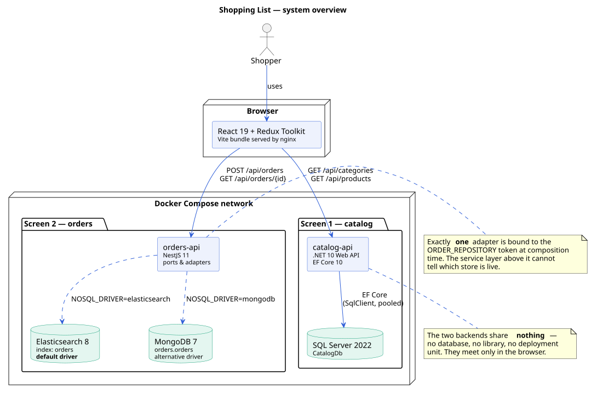
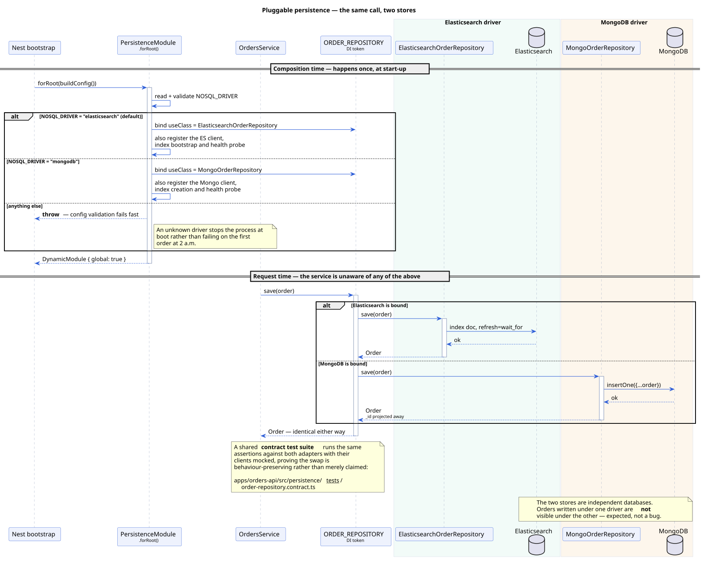

# Architecture

This document explains how the system is built and, more importantly, **why**.
Every non-obvious decision below was a choice with alternatives; where the
alternative was reasonable, it is named and the trade-off is stated.

- [1. System shape](#1-system-shape)
- [2. The contract-first spine](#2-the-contract-first-spine)
- [3. Client — React 19 + Redux Toolkit](#3-client--react-19--redux-toolkit)
- [4. Catalog API — .NET 10 + EF Core + SQL Server](#4-catalog-api--net-10--ef-core--sql-server)
- [5. Orders API — NestJS + Elasticsearch / MongoDB](#5-orders-api--nestjs--elasticsearch--mongodb)
- [6. Data models side by side](#6-data-models-side-by-side)
- [7. Cross-cutting concerns](#7-cross-cutting-concerns)
- [8. Testing strategy](#8-testing-strategy)
- [9. Design patterns index](#9-design-patterns-index)
- [10. Decision log](#10-decision-log)
- [11. What I would do differently at production scale](#11-what-i-would-do-differently-at-production-scale)

Diagrams live in [`docs/diagrams/`](diagrams/) as PlantUML source with rendered
SVGs beside them.

---

## 1. System shape



Three independently deployable components, as the assignment specifies:

| Component | Stack | Owns |
|---|---|---|
| `apps/client` | React 19, Redux Toolkit, RTK Query, Vite | Both screens, all UI state |
| `apps/catalog-api` | .NET 10, EF Core 10, SQL Server 2022 | Categories and products (read-only) |
| `apps/orders-api` | NestJS 11, Elasticsearch 8 / MongoDB 7 | Confirmed orders (write + read) |

### Why two backends rather than one

Because the assignment says so — but it is also a defensible split, and worth
being able to defend. The two halves have genuinely different characteristics:

|  | Catalog | Orders |
|---|---|---|
| Access pattern | Read-heavy, nearly static | Write-once, read-rarely |
| Shape | Highly relational (category → products) | Self-contained documents |
| Consistency need | Strong; a product belongs to exactly one category | None across orders |
| Natural store | Relational | Document / search |

A relational store for the catalog and a document store for orders is not
technology tourism; it is each half using the model that fits. The cost is two
deployment units and two connection pools, which at this scale is trivial.

**The two backends share nothing.** No database, no shared library, no common
deployment unit. They are joined only in the browser. That means either can be
stopped and the other keeps serving its screen — a property worth demonstrating
in an interview by stopping one container.

### Trust boundary

The browser is untrusted input. Concretely:

- The client sends **quantities and unit prices**; it never sends a total. The
  orders service recomputes every total server-side.
- Every field is validated twice — once in the client for immediate feedback,
  once on the server for correctness. The client's validation is a convenience;
  the server's is the rule.
- `forbidNonWhitelisted` on the orders service rejects any payload carrying a
  property the DTO does not declare, rather than silently ignoring it.

---

## 2. The contract-first spine

[`docs/CONTRACT.md`](CONTRACT.md) is the single source of truth: DTO shapes,
endpoint paths, ports, environment variable names and the client's design
tokens. All three components were written against it rather than against each
other.

This matters more than it sounds. With three codebases in three languages, the
wire format is the only thing they share, and it is exactly the thing that
silently drifts. Writing it down first means:

- The TypeScript types in `apps/client/src/types/` are a transcription of the
  contract, not a guess at what the server returns.
- The C# records in `Contracts/` and the Nest DTOs both serialise to shapes the
  contract prescribes, with camelCase and the same enum spellings.
- When the interviewer asks "what happens if the catalog adds a field", the
  answer is a document, not a shrug.

Both services also publish **OpenAPI** documents generated from the code
(`/swagger` and `/docs`), so the contract is machine-checkable at runtime, not
just prose.

---

## 3. Client — React 19 + Redux Toolkit

### 3.1 The state ownership question

The single most consequential decision in a Redux app is *what belongs in the
store*. The answer here is deliberately narrow.

```
store
├── cart          ← client-owned domain state (a plain slice)
├── ui            ← theme + locale (a plain slice)
├── catalogApi    ← RTK Query cache (server state)
└── ordersApi     ← RTK Query cache (server state)
```

**Server state** — categories, products, orders — lives in RTK Query. It is
fetched, cached, deduplicated, and invalidated by tag. It is never copied into a
reducer, because a copy is a second source of truth that immediately begins to
rot.

**Client state** — the cart and the UI preferences — lives in plain slices,
because nothing on any server knows or cares about them.

The common anti-pattern this avoids is the "fetch in a thunk, store the result
in a slice" shape, which reimplements caching, loading flags and error handling
by hand, badly, in every feature. `useGetCategoriesQuery()` gives all three for
free and dedupes the request across the two components that need it — which is
why screen 1 issues exactly **one** catalog request even though the picker and
the product grid both consume it. There is a test asserting that.

### 3.2 Cart data structure

```ts
interface CartState {
  items: Record<number, CartItem>;  // keyed by productId
  ids: number[];                    // insertion order
  lastAddedId: number | null;       // drives the flash animation
}
```

Normalised rather than an array, for three reasons:

1. **Adding the same product twice increments one line** instead of creating a
   duplicate. With an array that is a linear scan on every add; with a map it is
   a property lookup.
2. **Quantity updates are O(1)**, not `map` over the whole list producing a new
   array each time.
3. `ids` exists because object key order is not something to rely on for
   integer-like keys — JavaScript reorders them numerically. Insertion order is
   a user-visible property (the cart should not reshuffle), so it is stored
   explicitly.

This is the same shape `createEntityAdapter` produces. It is hand-written here
because the cart has exactly one non-standard field (`lastAddedId`) and three
mutations; the adapter would have added indirection without removing code.

**Totals are derived, never stored.** `selectCartTotal` is a memoised
`createSelector`. A stored total is a denormalisation that must be updated on
every one of the four cart mutations, and the bug where it drifts from the items
is both classic and invisible until a customer complains.

### 3.3 Persistence

A **listener middleware** watches the four cart actions and the four UI actions
and mirrors state to `localStorage`. Middleware rather than a `useEffect`
because persistence is a side effect of *actions*, not of rendering — it belongs
in the store's pipeline, and putting it there means no component has to remember
to trigger it.

Everything read back is **validated field by field**. Storage is user-writable
and survives across deploys, so it must be treated as hostile input: a
hand-edited or half-written entry degrades to an empty cart instead of crashing
the app on boot. Every access is wrapped in `try/catch` because `localStorage`
throws outright in some privacy modes.

### 3.4 Theming

Every colour in the app resolves through a CSS custom property, defined once on
`:root` and overridden in a single `[data-theme="dark"]` block. There is no
second stylesheet and no colour literal outside `tokens.css`.

Theme is **tri-state**: light, dark, or follow the system. In system mode the
app subscribes to `prefers-color-scheme` and repaints live when the OS changes —
not just on reload. A small inline script in `index.html` applies the persisted
choice **before first paint**, which is the difference between a polished app
and one that flashes white for 200 ms on every reload.

`useAppearance` is the single place where Redux state touches the DOM. No
component sets `data-theme` or `dir` itself.

### 3.5 Right-to-left

One stylesheet serves both directions. The rule enforced throughout is: **no
physical direction properties.** `margin-inline-start`, not `margin-left`;
`inset-inline-end`, not `right`; `text-align: start`, not `left`. Switching
`dir` on `<html>` then mirrors the whole layout correctly.

Exactly two rules key off direction, and both are genuinely directional: the
`<select>` chevron's background position, and the back-arrow glyph. Everything
else is direction-agnostic by construction.

Two details that are easy to miss and look wrong when missed:

- Prices and the email input are wrapped in `direction: ltr; unicode-bidi:
  isolate`, otherwise the bidirectional algorithm scrambles `₪13.80` and
  `dana@example.com` inside Hebrew text.
- Product and category names arrive from the API in **both** languages
  (`nameHe` / `nameEn`). Switching language re-labels the catalog with no
  refetch, because the data was always there.

Hebrew pluralisation is also handled: i18next resolves through
`Intl.PluralRules`, and Hebrew has more categories than English, so `he.json`
carries `_one`, `_two`, `_many` and `_other` forms.

### 3.6 Component design

`components/ui/` holds presentational primitives with no store access —
`Button`, `Card`, `Field`, `QuantityStepper`, `StatusMessage`, `Tooltip`.
`features/*/` holds components that are connected to the store. Pages compose
features.

Two pieces worth pointing at in an interview:

**`Tooltip`** renders through a **portal** onto `<body>` and positions itself in
viewport coordinates. The cart list is a scroll container, so a bubble
positioned above the first row would be clipped by its own parent; a portal is
the correct fix rather than a hack. It is `aria-hidden` on purpose: CSS ellipsis
truncation is a visual effect only, the full name is already in the DOM and
already announced, and duplicating it in ARIA would make a screen reader read
every product name twice.

**`useIsTruncated`** measures `scrollWidth` against `clientWidth` through a
`ResizeObserver`, so the tooltip only appears when the name is *actually*
clipped. A tooltip that repeats text you can already read is noise.

---

## 4. Catalog API — .NET 10 + EF Core + SQL Server

### 4.1 Layering

```
Api/            controllers, middleware        → HTTP concerns only
Application/    ICatalogService, exceptions    → use cases, no EF types leak out
Domain/         Category, Product, ProductUnit → plain entities, no attributes
Infrastructure/ DbContext, configurations, seeder, initializer
Contracts/      DTOs + mapping extensions      → the wire shape
```

Dependencies point inward: `Api` → `Application` → `Domain`, with
`Infrastructure` implementing what `Application` declares. The controller never
sees `DbContext`; the service never sees `HttpContext`.

The domain entities carry **no data annotations**. All persistence concern lives
in `IEntityTypeConfiguration<T>` classes under `Infrastructure/Persistence/
Configurations/`, applied by `ApplyConfigurationsFromAssembly`. This is the
Fluent API over attributes decision: attributes would couple the domain model to
EF Core, and `[MaxLength(80)]` on a domain type is a database fact wearing a
domain hat.

### 4.2 The EF Core model

```csharp
// CategoryConfiguration
builder.ToTable("Categories");
builder.HasKey(c => c.Id);
builder.Property(c => c.Slug).HasMaxLength(64).IsRequired();
builder.HasIndex(c => c.Slug).IsUnique();
builder.Property(c => c.NameEn).HasMaxLength(120).IsRequired();
builder.Property(c => c.NameHe).HasMaxLength(120).IsRequired();

// ProductConfiguration
builder.Property(p => p.PricePerUnit).HasPrecision(10, 2);
builder.Property(p => p.Unit).HasConversion<string>();
builder.HasIndex(p => p.CategoryId);
builder.HasOne(p => p.Category)
       .WithMany(c => c.Products)
       .HasForeignKey(p => p.CategoryId)
       .OnDelete(DeleteBehavior.Cascade);
```

Four decisions in there worth defending:

**`decimal` with `HasPrecision(10, 2)`, not `double`.** Money is never a
floating-point type. `double` cannot represent `6.90` exactly, and the errors
compound across a cart. SQL Server maps this to `decimal(10,2)`.

**The enum is persisted as a string** via `HasConversion<string>()`, not as its
integer ordinal. An `int` column means the database is unreadable without the
C# source, and reordering the enum silently corrupts every existing row.
`"carton"` in the column costs a few bytes and survives refactoring.

**A unique index on `Slug`.** The primary key is a surrogate identity `int`,
which is right for joins, but the slug is the stable human key and the database
should enforce that it is unique rather than trusting the seeder.

**Cascade delete** from category to products, because a product cannot exist
without its category — that is a real invariant, not a convenience.

### 4.3 Querying

`CatalogService.GetCategoriesAsync` runs **two flat queries and stitches them in
memory** rather than a single `Include`:

```csharp
var categories = await _db.Categories.AsNoTracking()
    .OrderBy(c => c.SortOrder).ToListAsync(ct);
var products = await _db.Products.AsNoTracking()
    .Where(p => p.IsActive).ToListAsync(ct);
```

Why: a join returns the category columns once per product (a cartesian result
set), and filtered `Include` support varies by provider. Two indexed queries
over ~50 rows is faster, provider-agnostic, and lets the same code run against
the in-memory provider in tests.

`AsNoTracking()` everywhere, because this API never writes. The change tracker
is pure overhead on a read path, and turning it off is the single cheapest EF
Core performance win there is.

### 4.4 Schema creation and seeding


`DatabaseInitializer` runs at startup inside **its own DI scope** — not resolved
from the root provider, which would capture a scoped `DbContext` in a singleton.

It calls `EnsureCreatedAsync()` rather than `MigrateAsync()`. That is a
deliberate trade-off documented in
[`apps/catalog-api/MIGRATIONS.md`](../apps/catalog-api/MIGRATIONS.md): for a
demo whose database is created from scratch every time, `EnsureCreated` is the
honest choice, and a hand-written migration whose model snapshot silently
disagrees with the configurations is worse than none — every future
`migrations add` then produces a wrong diff. The file gives the one command and
the one-line change to move to real migrations for production.

The seeder is **idempotent**, guarded by `AnyAsync()`, so restarting against a
populated volume is a no-op. It seeds 6 categories and 48 products, every one
with a Hebrew name, an English name, an emoji and a realistic ILS price.

Connecting is wrapped in a **retry loop with backoff** (10 attempts,
2s/4s/…/15s) because SQL Server takes 30–45 seconds to accept connections and
`depends_on: service_healthy` is not by itself enough on a cold volume. Crucially
the initializer **never throws**: a database-less API starts and reports `503` on
`/health` rather than crash-looping, which is both easier to diagnose and better
behaviour under an orchestrator.

### 4.5 Error handling

`ExceptionHandlingMiddleware` sits outermost and converts exceptions into
RFC 7807 `application/problem+json`:

| Thrown | Status | Body |
|---|---|---|
| `NotFoundException` | 404 | `type`, `title`, `status`, `detail`, `traceId` |
| `ArgumentException` (not `ArgumentNullException`) | 400 | as above |
| `OperationCanceledException` when the client aborted | — | logged at Debug, no response |
| anything else | 500 | generic detail; the real exception is logged, not returned |

Two subtleties: a client disconnect is not a server error and must not be logged
as one or written onto a dead socket; and `ArgumentNullException` is
deliberately excluded from the 400 branch, because every guard clause in the
codebase throws it — an internal contract violation is a 500, and returning
`"Value cannot be null. (Parameter 'catalogService')"` to a browser leaks
internals.

### 4.6 DI lifetimes

| Service | Lifetime | Why |
|---|---|---|
| `CatalogDbContext` | Scoped | EF Core's unit of work is per request |
| `ICatalogService` | Scoped | depends on the context |
| `DatabaseInitializer` | Scoped | resolved inside an explicit startup scope |
| `ExceptionHandlingMiddleware` | Singleton (convention) | takes only `RequestDelegate` + `ILogger` |

No captive dependencies: nothing longer-lived holds anything shorter-lived.

---

## 5. Orders API — NestJS + Elasticsearch / MongoDB

### 5.1 Ports and adapters



This is the headline design decision of the service. The assignment permits
MongoDB *or* Elasticsearch and prefers Elasticsearch. Rather than picking one
and losing the other, the persistence layer is a **port with two adapters**:

```
OrdersService
     │  depends only on ↓
OrderRepository (abstract class)   ← the port
     │  bound at composition time to exactly one of ↓
     ├── ElasticsearchOrderRepository   ← adapter (default)
     └── MongoOrderRepository           ← adapter
```

`PersistenceModule.forRoot()` is a **dynamic module** that reads validated
config once at bootstrap and registers one driver's providers against the
`ORDER_REPOSITORY` token:

```ts
const providers = config.nosqlDriver === 'mongodb'
  ? mongoDriverProviders(config)
  : elasticsearchDriverProviders(config);

return { module: PersistenceModule, global: true, providers,
         exports: [ORDER_REPOSITORY, STORE_HEALTH_INDICATOR] };
```

Nothing above the token knows which store is live — not the service, not the
controller, not the client. Adding a third driver (Postgres JSONB, DynamoDB)
means writing one adapter and adding one `case`; no existing file changes.
That is the Open/Closed Principle with a concrete payoff rather than a slogan.

Two details:

- The port is an **abstract class**, not an `interface`. TypeScript interfaces
  are erased at compile time and cannot be a DI token; an abstract class
  survives to runtime and can be used as one. The explicit string token is used
  anyway, because it makes the binding visible in one place.
- An unknown `NOSQL_DRIVER` **fails at boot**, not on the first order. Config
  validation runs before the module graph is built.

Both adapters are covered by a **shared contract test suite** that runs the same
assertions against each with its client mocked, asserting they produce identical
`Order` results. That is what turns "the swap is safe" from a claim into a
verified property.

### 5.2 Server-side computation

`OrdersService.create` treats the request as raw material:

```
lineTotal   = round2(quantity × unitPrice)   // per item
itemCount   = Σ quantity
totalAmount = round2(Σ lineTotal)
id          = generated server-side
reference   = "ORD-" + 6 uppercase hex
status      = "confirmed"
currency    = "ILS"
createdAt   = server clock, ISO 8601
```

Nothing in that list is taken from the client. `round2` uses the
`Math.round((v + Number.EPSILON) * 100) / 100` form rather than `toFixed`,
because `toFixed` returns a string and has its own rounding surprises.

### 5.3 Validation

`class-validator` with a global `ValidationPipe` configured
`{ whitelist: true, forbidNonWhitelisted: true, transform: true }`:

- `whitelist` strips undeclared properties.
- `forbidNonWhitelisted` **rejects** rather than strips — a payload with an
  unexpected field is a bug or an attack, and silently ignoring it hides both.
- `transform` turns the plain JSON body into a real DTO instance, which is what
  makes nested `@ValidateNested({ each: true }) @Type(() => OrderItemDto)`
  actually validate the array elements rather than waving them through.

A custom `IsTwoWords` validator enforces the assignment's "first and last name"
in a single field.

### 5.4 The Elasticsearch mapping

[`infra/elasticsearch/orders.mapping.json`](../infra/elasticsearch/orders.mapping.json)
is an explicit deliverable of the assignment, so it is designed rather than
generated.

```json
"dynamic": "strict"
```

**Strict, not dynamic.** With dynamic mapping, the first document containing a
typo creates a real field with a guessed type, permanently. Strict makes that
document a `400` instead. In a schema-less store, the schema you refuse to write
is the schema you get anyway — just chosen by whichever document arrived first.

```json
"items": { "type": "nested", ... }
```

**`nested`, not the default object array.** This is the single most important
line in the file. Elasticsearch flattens object arrays into parallel lists, so
`{items.quantity: 2, items.unit: "carton"}` would match an order containing 2 of
something else *and* a carton of something else again. `nested` indexes each
item as a hidden sub-document so per-item predicates hold together. The cost is
one Lucene document per item and the requirement to use `nested` queries; both
are correct prices for correct answers.

```json
"customer": { "email": { "type": "keyword", "normalizer": "lowercase_normalizer" } }
```

**`keyword` with a normalizer, not `text`.** An email is an identifier, not
prose — you look it up exactly, you never search it for words. The normalizer
lowercases and folds accents at index time so lookups are case-insensitive
without an analysis chain.

```json
"fullName": { "type": "text", "fields": { "keyword": { "type": "keyword" } } }
```

**A multi-field** for names: `text` for "find orders by someone called Levi",
`.keyword` for exact match, sorting and aggregation. This is the standard
answer to "can I both search and aggregate on this field", and being able to
explain it is table stakes for an Elasticsearch question.

```json
"unitPrice": { "type": "scaled_float", "scaling_factor": 100 }
```

**`scaled_float`, not `float`.** It stores `6.90` as the long `690`, which is
exact for money at two decimal places and compresses better than a float.

`number_of_replicas: 0` because a single-node local cluster can never allocate a
replica and would sit permanently `yellow` otherwise. `_meta` records the
application, a schema version and a link back to the contract, so someone
finding this index in six months knows what wrote it.

The index is created at startup only if absent. The mapping is also embedded as
a TypeScript constant so the container works even without the file mounted, and
**a test deep-equals the two** — drift between them is a build failure, not a
production surprise.

### 5.5 Elasticsearch write semantics

```ts
await this.client.index({ index, id: order.id, document, refresh: 'wait_for' });
```

`refresh: 'wait_for'` is there for a specific reason. Elasticsearch is
near-real-time: by default a document is searchable after the next refresh, up
to 1 second later. The app redirects to the receipt immediately after the POST
resolves, and the receipt may re-read the order. Without `wait_for`, that read
can legitimately return nothing. `wait_for` blocks the response until the
document is visible — the right trade for a user-facing write at this volume.
`refresh: true` would force an immediate refresh and is the wrong tool: it
hurts cluster-wide indexing throughput for everyone.

Reads use `get` (not `search`) by id, which bypasses the refresh problem
entirely, and `search` with `track_total_hits: true` for listing, because
otherwise Elasticsearch caps the reported total at 10,000 and the pagination UI
lies.

### 5.6 The MongoDB adapter

Uses the **official driver, not Mongoose**. Mongoose would introduce a second
schema definition that must be kept in step with the Elasticsearch mapping and
the TypeScript types — three descriptions of one shape. The driver keeps the
adapter symmetrical with the Elasticsearch one: both map a domain `Order` to a
plain document and back.

```ts
await this.collection.createIndexes([
  { key: { createdAt: -1 }, name: 'orders_createdAt_desc' },
  { key: { id: 1 }, name: 'orders_id_unique', unique: true },
  { key: { reference: 1 }, name: 'orders_reference' },
]);
```

The `createdAt` descending index backs the default listing sort; without it a
list is a collection scan plus an in-memory sort, which fails outright past
32 MB. The unique index on `id` makes the domain identifier a real constraint
rather than a hope.

`{ projection: { _id: 0 } }` on every read: Mongo's `_id` is an implementation
detail of the adapter and must not leak into the domain object or the API
response. The domain id is `id`.

The client is created **once** as a provider with a configurable `maxPoolSize`,
connected on init and closed on `onApplicationShutdown`. Connection pooling is a
per-process concern; creating a client per request is the classic way to exhaust
a database's connection limit.

### 5.7 Health

`GET /health` returns `{ status, driver, store }`. The `driver` field is the
fastest way to answer "which database am I actually talking to right now",
which matters precisely because the answer is configurable. Terminus was not
used because the contract pins an exact response shape that is not Terminus's;
a two-method `StoreHealthIndicator` port with one implementation per driver is
smaller and matches the shape exactly.

---

## 6. Data models side by side

The same order, in three representations.

**On the wire** (contract §3):

```jsonc
{ "id": "...", "reference": "ORD-8F3A21",
  "customer": { "fullName": "...", "address": "...", "email": "..." },
  "items": [{ "productId": 101, "categoryId": 1, "nameEn": "Milk 3%",
              "nameHe": "חלב 3%", "unit": "carton", "quantity": 2,
              "unitPrice": 6.90, "lineTotal": 13.80 }],
  "itemCount": 2, "totalAmount": 13.80, "currency": "ILS",
  "locale": "he", "status": "confirmed", "createdAt": "2026-08-31T..." }
```

**In Elasticsearch**: one document per order, `_id` = the domain `id`, `items`
as `nested` sub-documents, money as `scaled_float(100)`, `createdAt` as `date`,
identifiers as `keyword`.

**In MongoDB**: one document per order in `orders.orders`, structurally
identical to the wire shape, with Mongo's `_id` projected away on every read and
three indexes backing lookup, uniqueness and the listing sort.

And the catalog, which is relational rather than document:

```
Categories                        Products
──────────                        ────────
Id          int identity PK       Id            int identity PK
Slug        nvarchar(64) UQ       CategoryId    int FK → Categories.Id (cascade, indexed)
NameEn      nvarchar(120)         Slug          nvarchar(64) UQ
NameHe      nvarchar(120)         NameEn        nvarchar(120)
SortOrder   int                   NameHe        nvarchar(120)
                                  Unit          nvarchar → enum as string
                                  PricePerUnit  decimal(10,2)
                                  Emoji         nvarchar
                                  IsActive      bit
```

Note the deliberate asymmetry: the catalog is **normalised** because a product
belongs to exactly one category and that relationship must be enforced. The
order is **denormalised** — it copies each product's name and price at the
moment of ordering. That is not duplication by accident; an order is a historic
record, and if the price of milk changes tomorrow the order placed today must
still say what was actually charged. Referencing the catalog by id alone would
silently rewrite history.

---

## 7. Cross-cutting concerns

**Configuration.** Every setting has a working default, so the stack runs with
no `.env` at all; `.env.example` documents the overrides. The orders service
validates its environment at boot and fails fast on nonsense. The client's
config is compiled in, because Vite inlines `import.meta.env` at build time —
which is why changing an API port requires rebuilding that image, and the README
says so.

**CORS.** Both services allow the dev-server origin and the containerised
client origin, read from configuration rather than hard-coded.

**Errors.** Each service uses the idiom of its ecosystem: RFC 7807
`ProblemDetails` for .NET, Nest's `{ statusCode, error, message[] }` for Node.
The client handles both and never shows a raw error to the user — it shows a
localised message plus the URL it failed to reach, which is the single most
useful thing to put in front of someone whose Docker stack is half up.

**Observability.** Health endpoints on both services, wired into Docker
healthchecks, with `depends_on: service_healthy` gating start-up order.
Structured logging via each framework's logger; the .NET side attaches a
`traceId` to every problem response for correlation.

---

## 8. Testing strategy

| Component | Tooling | Count | Coverage |
|---|---|---|---|
| client | Vitest, Testing Library, MSW | 313 | 100% statements / lines |
| orders-api | Jest, supertest | 316 unit + 45 e2e | 100% statements / lines |
| catalog-api | xUnit, FluentAssertions, Moq, EF in-memory | 54 | — |

Thresholds are enforced in configuration on both Node projects, so a coverage
drop fails the run rather than producing a warning nobody reads.

The strategy, rather than the numbers:

**Mock at the boundary, not inside.** Client tests render components inside the
*real* provider stack — real store, real i18next, real router — and mock only
the network, at the HTTP layer, with MSW. A test that mocks `useSelector` tests
the mock; a test that dispatches a real action through a real reducer tests the
application. It also means a failure points at a defect rather than at a stale
mock.

**Test behaviour, not implementation.** Queries are by role and accessible name
where possible, so a refactor that preserves behaviour does not break the suite —
and a component that cannot be found by its accessible name has an accessibility
bug the test has just caught for free.

**One suite, two implementations.** The orders repository contract suite runs
identical assertions against both adapters. That is the test that makes the
pluggable design credible.

**Guard the things humans forget.** A test asserts every i18n key exists in both
languages with matching interpolation placeholders, so a forgotten Hebrew string
is a red build rather than a `missingKey` in front of the interviewer. Another
deep-equals the Elasticsearch mapping file against its embedded copy. The
orders e2e suite replays the OpenAPI document's own examples against the live
app, so a documented example cannot silently rot.

**One end-to-end journey.** `client/src/App.test.tsx` walks the whole flow —
load the catalog, add products through both paths, fill the form, submit — and
asserts on the exact payload the orders API received.

---

## 9. Design patterns index

For quick reference in an interview. Each is a real usage in this codebase, not
a checklist entry.

| Pattern | Where | Why there |
|---|---|---|
| **Ports & Adapters** (Hexagonal) | `orders-api/src/persistence` | Two stores behind one port; the swap is config, not code |
| **Repository** | `OrderRepository` | Isolates the domain from the storage API |
| **Strategy** (selected by config) | `NOSQL_DRIVER` | Chooses the persistence algorithm at composition time |
| **Factory / Dynamic Module** | `PersistenceModule.forRoot()` | Builds the provider set from validated config |
| **Dependency Injection** | Both backends | Constructor injection throughout; no service locator |
| **DTO + Mapper** | `Contracts/` (C#), `mappers/` (TS) | Wire shape decoupled from domain and persistence shapes |
| **Unit of Work** | EF Core `DbContext` | Scoped per request |
| **Options / typed configuration** | `configuration.ts`, `appsettings.json` | Validated once, injected as a typed object |
| **Middleware / Chain of Responsibility** | `ExceptionHandlingMiddleware`, `ValidationPipe` | Cross-cutting concerns outside the handlers |
| **Facade** | `CatalogService`, `OrdersService` | One use-case entry point over several collaborators |
| **Flux / unidirectional data flow** | Redux Toolkit | Actions in, new state out, view re-renders |
| **Observer** | `createListenerMiddleware` | Persistence reacts to actions without coupling to components |
| **Memoisation** | `createSelector` | Derived totals recomputed only when inputs change |
| **Provider** | React context (`Provider`, `I18nextProvider`) | Dependency injection for the component tree |
| **Custom hooks** | `useAppearance`, `useIsTruncated`, typed `useAppSelector` | Reusable stateful logic outside components |
| **Portal** | `Tooltip` | Escapes a clipping ancestor |
| **Adapter** (client side) | `localizedName` | One bilingual record, two presentations |
| **Guard clause** | `ArgumentNullException.ThrowIfNull` | Fail fast at the boundary |
| **Idempotent initialiser** | `CatalogSeeder`, ES index bootstrap | Safe to re-run on every start |
| **Retry with backoff** | `DatabaseInitializer` | Tolerates a database that is still booting |

---

## 10. Decision log

| # | Decision | Alternative | Why this one |
|---|---|---|---|
| 1 | Two backends, no shared code | One BFF fronting both | The assignment requires it, and the halves have genuinely different data models. Cost: two deploy units |
| 2 | RTK Query for server state | Thunks + slices | Caching, dedupe and request state for free; no second source of truth |
| 3 | Normalised cart keyed by id | Array of line items | O(1) updates, no duplicate lines, explicit ordering |
| 4 | Derived totals | Stored totals | Cannot drift from the items |
| 5 | CSS Modules + custom properties | Tailwind / CSS-in-JS | Full control of RTL logical properties and theming; zero runtime cost |
| 6 | Fluent API in configuration classes | Data annotations on entities | Keeps EF Core out of the domain model |
| 7 | Enum stored as string | Integer ordinal | Database stays readable; reordering the enum cannot corrupt rows |
| 8 | `decimal(10,2)` | `float`/`double` | Money is not a floating-point type |
| 9 | Two queries + in-memory stitch | `Include` with a join | Avoids a cartesian result set; provider-agnostic |
| 10 | `EnsureCreated` | Hand-written EF migration | Cannot verify a snapshot without the SDK; a wrong snapshot poisons every future migration. Documented escape hatch |
| 11 | Ports & adapters for persistence | Pick one store | Honours the stated preference *and* keeps the alternative; demonstrates the architecture the role tests for |
| 12 | Official Mongo driver | Mongoose | Avoids a third description of the same shape |
| 13 | `nested` items in Elasticsearch | Default object array | Prevents cross-matching between cart lines |
| 14 | `dynamic: strict` | Dynamic mapping | A typo becomes a 400, not a permanent phantom field |
| 15 | `refresh: wait_for` on write | Default / `refresh: true` | Read-after-write for the receipt without hurting cluster throughput |
| 16 | Server recomputes totals | Trust the client | The browser is untrusted input |
| 17 | Hebrew default with full RTL | English default | The assignment and its mockups are Hebrew |
| 18 | MSW at the HTTP boundary | Mocking hooks/modules | Tests exercise real wiring; failures mean real defects |

---

## 11. What I would do differently at production scale

Being able to name the limits of your own design is usually the most useful
thing you can say about it.

- **Authentication and authorisation.** There is none. Both APIs are open. A
  real system needs at minimum an authenticated `POST /orders` and an ownership
  check on `GET /orders/:id` — currently anyone with an id can read any order.
- **Real EF migrations.** `EnsureCreated` cannot evolve a schema. Production
  needs versioned migrations applied by a deployment step, not by the app.
- **Idempotency on order creation.** A double-clicked submit or a retried
  request creates two orders. The fix is a client-supplied idempotency key,
  stored and checked before insert.
- **Optimistic concurrency.** Orders are write-once here so it does not bite,
  but a mutable order would need a version field.
- **Secrets.** The SQL Server password is in `docker-compose.yml`. That is
  correct for a throwaway local stack and wrong everywhere else; production
  wants a secret manager.
- **Elasticsearch as a system of record.** It is used as one here because the
  assignment asked for it. In production I would treat it as a search index
  fed from a durable store — it has no transactions, and near-real-time
  visibility is a genuine constraint rather than an inconvenience.
- **Observability.** Structured logs only. Production wants distributed
  tracing across the browser and both services, and metrics on order latency
  and failure rate.
- **Catalog caching.** The catalog is near-static and refetched per session.
  ETags plus a CDN in front would remove almost all of that traffic.
- **Pagination on the catalog.** Fine at 48 products; wrong at 48,000.
